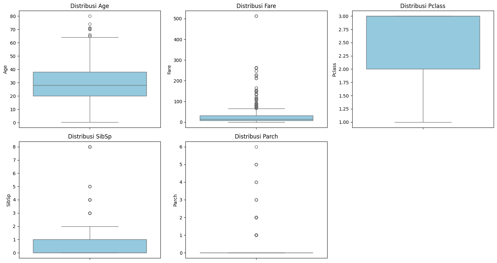
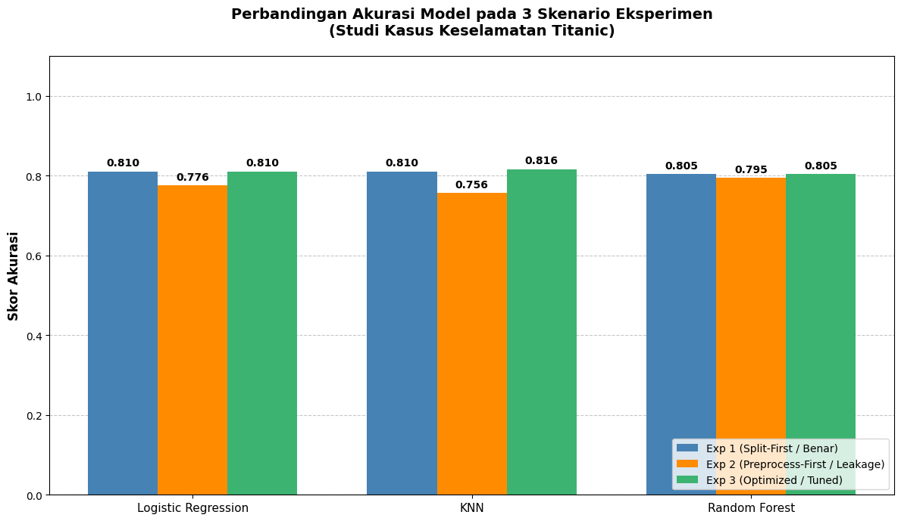

# The Data Leakage Experiment: Why Clean Methodology Beats Algorithm Choice


> **View the visual summary and experimental breakdown on my [Portfolio Website ↗]([MASUKKAN_LINK_WEBSITE_PORTOPOLIO_KAMU_DISINI])**

## 📌 Problem Statement: The Methodology Crisis
The Titanic dataset is the most famous sandbox in Machine Learning. However, most practitioners approach it purely as an algorithm competition, ignoring the structural integrity of their data processing. The critical issue often overlooked is **Data Leakage**—fitting scalers or imputers on the entire dataset *before* splitting it into train and test sets.

This project is not just about predicting survival; it is a controlled experiment designed to measure exactly how Data Leakage impacts the performance of Logistic Regression, KNN, and Random Forest models.

## 🗂️ Data Architecture & Experimental Design

**1. Domain-Aware Data Wrangling:** 
Imputed missing ages using the median age per `Pclass` (Passenger Class), acknowledging that socio-economic status heavily influenced age demographics on the ship. Capped `Fare` outliers using the IQR method because extreme VIP ticket prices create mathematical noise for distance-based algorithms.



**2. The Three-Pipeline Experiment:**
To objectively measure the impact of methodology, I built three separate classification pipelines:
* **Experiment 1 (Clean Pipeline):** Split data first ➔ Fit preprocessing (StandardScaler) exclusively on training data ➔ Transform test data using training parameters.
* **Experiment 2 (Deliberate Leakage):** Fit preprocessing on the full dataset ➔ Split data ➔ Apply transformation. *(Intentionally introducing information leakage).*
* **Experiment 3 (Optimized):** Clean Pipeline + `GridSearchCV` hyperparameter tuning with `StratifiedKFold` cross-validation.

---

## 📊 Key Findings & Model Evaluation



### Key Findings
**1. The Data Leakage Myth: It Doesn't Always Inflate Accuracy**
A common assumption is that data leakage unfairly *inflates* test accuracy. This experiment proved the opposite. Leakage distorted the underlying training distribution, causing all three algorithms to consistently perform WORSE (Exp 2 vs Exp 1). Logistic Regression dropped from 0.810 to 0.776, and KNN dropped from 0.810 to 0.756.

**2. KNN is the Most Sensitive to Proper Scaling**
Distance-based algorithms (like KNN) benefit the most from strict outlier handling and clean `StandardScaler` fitting. When forced into a clean pipeline (Exp 1), KNN matched Logistic Regression. When optimized (Exp 3), KNN pulled ahead to achieve the highest overall accuracy (81.6%).

**3. 81% Accuracy Still Means 32 Wrong Predictions**
While the optimized KNN model correctly predicted 94 non-survivors and 52 survivors, it still produced 12 False Positives (predicted survived but died) and 20 False Negatives (predicted died but survived). In a maritime safety context, every false prediction has severe consequences.

---

## 💡 Strategic Recommendations & ML Best Practices
1. **Always Implement Strict Pipeline Architecture:** Preprocessing steps (Scaling, Imputation, Encoding) must be fitted *exclusively* on training data. Never expose your model's preprocessing layer to test data distributions.
2. **Beware of False Confidence:** The cost of a leaked pipeline is not just lower accuracy; it is the false confidence in deploying a "defective" model that was never tested fairly against unseen data.
3. **Algorithm Choice is Secondary:** The experiment clearly demonstrates that the difference between a reliable model and a defective one is often not the choice of algorithm (RF vs KNN), but the structural order of operations.

## 📂 Repository Structure
```text
├── Dataset/
│   └── titanic/                 # Raw and cleaned csv datasets
├── images/                      # Experimental charts & EDA (viz_1, viz_11)
├── Program/
│   └── titanic_assignment.ipynb # Main experimental notebook (Pipeline & GridSearchCV)
├── requirements.txt             # Dependencies
└── README.md
```

## 🚀 How to Run & Reproduce
* Clone this repository: ```git clone https://github.com/Daaffaaisa/Titanic-Victim-Predictions.git```
* Install the necessary dependencies: ```pip install -r requirements.txt```
* Open ```Program/titanic_assignment.ipynb``` to view the code for the three comparative experiments and the GridSearchCV implementation.
